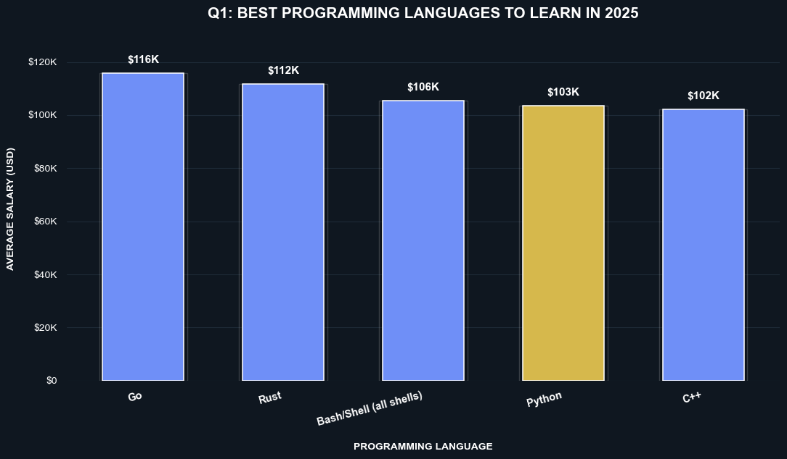
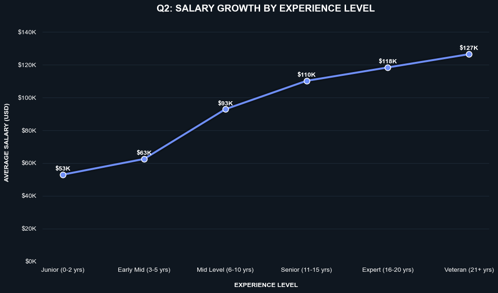
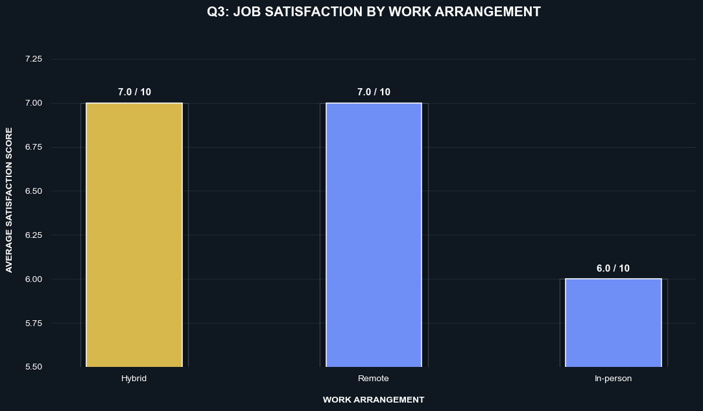
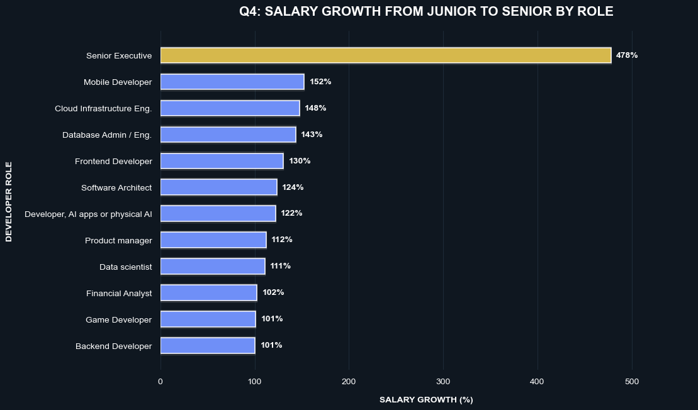
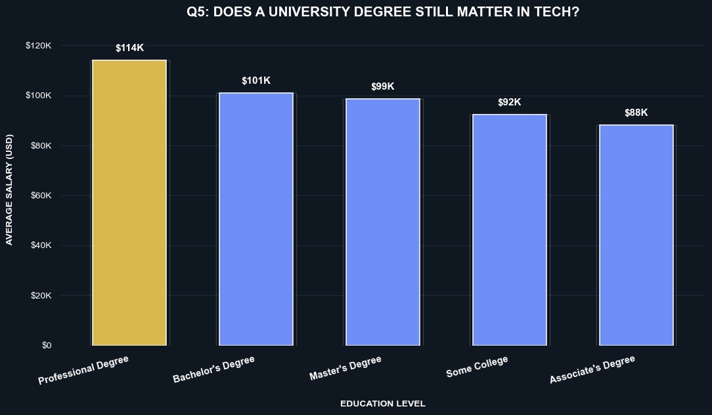

# Stack Overflow Developer Survey 2025 — SQL Analysis

## Project Overview
Analysis of 49,191 developer responses from the Stack Overflow 
2025 Developer Survey to uncover salary trends, career growth 
patterns and job satisfaction insights.

## Dataset
- Source: Stack Overflow Developer Survey 2025
- Link: https://survey.stackoverflow.co/
- Size: 49,191 respondents from 177 countries
- Clean data: 13,571 respondents after removing nulls and outliers

## Tools Used
- Microsoft SQL Server — data storage and analysis
- Python (Pandas, Matplotlib, Seaborn) — data visualization
- Jupyter Notebook — visualization environment
- GitHub — version control

## Business Questions

### Q1: Which programming languages are worth learning in 2025?

- Python offers the best salary-to-demand ratio ($103k, 7521 users)
- Go and Rust pay the most but serve niche markets
- JavaScript is most popular but ranks 13th in salary

### Q2: At what experience level does salary stop growing?

- Biggest salary jump happens between 3-10 years (+$30k, +49%)
- Growth rate drops from 49% to 7% after senior level
- Salary never fully stops growing but pace slows dramatically

### Q3: Which role + work arrangement has highest job satisfaction?

- Senior executives working remotely score highest at 8/10
- Hybrid work dominates top satisfaction scores across all roles
- In-person work consistently scores lowest

### Q4: Which roles have the best salary growth with experience?

- Mobile developers show best realistic growth at 152.5%
- Cloud engineers reach highest senior salary at $160,076
- AI/ML engineers start highest ($82k) but grow slowest (87%)

### Q5: Does a university degree still matter in tech in 2025?

- Bachelor's degree remains the sweet spot in tech
- Self taught developers earn only 8% less than degree holders
- Master's degree pays less than Bachelor's — surprising finding!

## Key SQL Concepts Used
- Views for data cleaning
- CASE WHEN for data categorization
- STRING_SPLIT + CROSS APPLY for multi-value columns
- CTEs for multi-step calculations
- Window functions for growth analysis
- HAVING vs WHERE filtering

## How to Run
1. Download dataset from https://survey.stackoverflow.co/
2. Load CSV into SQL Server using provided Python script
3. Run stackoverflow_survey_analysis.sql for all analysis
4. Run stackoverflow_analysis.ipynb for visualizations

## Project Structure
```
stackoverflow-survey-analysis/
│
├── charts/                          # all visualization images
├── stackoverflow_survey_analysis.sql # complete sql analysis
├── stackoverflow_analysis.ipynb      # python visualizations

```
